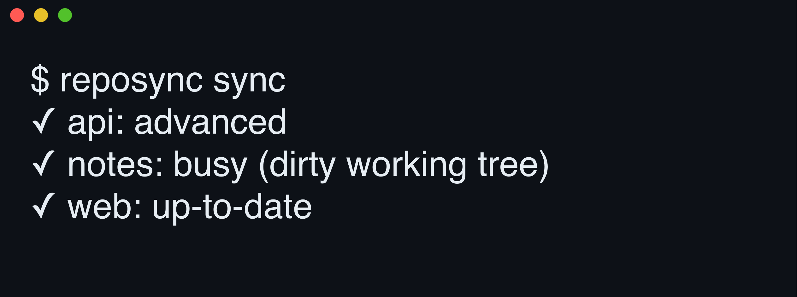

# 

**Your other machine already pulled.** reposync clones every registered repo to each peer host and fast-forwards trunk on filesystem events, skipping anything dirty, busy, or diverged.

[](https://github.com/yasyf/reposync/actions/workflows/ci.yml)
[](https://github.com/yasyf/reposync/releases)
[](LICENSE)

## Get started

```sh
brew install yasyf/tap/reposync
reposync repo add ~/Code/my-repo
reposync install
```

That's the whole setup. `reposync sync` runs the same converge pass the daemon now runs for you:



Driving with an agent? Paste this:

```text
Install reposync with `brew install yasyf/tap/reposync`.
Register my most-used repo with `reposync repo add <path>`, then run `reposync install` so the daemon keeps it converged.
Run `reposync sync` and report each repo's outcome (fast-forwarded, busy, up-to-date).
```

---

## Use cases

### Sit down at any machine with main already current

Switching machines starts with a round of `git pull` across every repo you touched last week — or you skip it and grep three-day-old code. Register the daemon once per host:

```sh
reposync install
```

synckitd waits out a 15-second quiet window after a repo's git metadata changes, then converges it and notifies your peers to do the same. By the time you've sat down at the other desk, main already moved.

### Add a repo once, find it cloned on every host

A new project exists on the machine where you started it and nowhere else. Register it:

```sh
reposync repo add ~/Code/new-thing
```

The repo joins a convergent registry that pull-merges across the mesh, and every peer clones it at the same relpath under its own `~/Code`, preferring `jj git clone --colocate` and falling back to plain git. `--local-only` keeps a repo off the mesh, and `reposync repo rm` untracks everywhere without deleting a checkout.

### Sync in the background without ever clobbering work in progress

A cron'd `git pull` doesn't know you're mid-rebase. An in-progress git or jj operation, activity within the idle threshold, a dirty tree, or a diverged trunk all gate the advance, and the skipped repo says why:

```console
$ reposync sync
✓ notes: busy (dirty working tree)
```

A stale lock left behind by a killed git or jj process no longer wedges a repo: sync clears a `packed-refs.lock` after 30 minutes, clears a jj lock of the same age once a flock probe confirms its holder is dead, and logs what it removed.

The only write it ever sends is a fast-forward push of your own trunk, and only after the repo has been quiet past `push_after` (a day by default).

## Commands

| Command | What it does |
| --- | --- |
| `reposync` | Open the TUI: toggle discovered repos on the Repos tab, add peers on the Hosts tab |
| `reposync repo add <path>` | Register a repo and converge it everywhere (`--local-only` keeps it on this host) |
| `reposync repo discover` | List git/jj repos under `default_location` and whether each is tracked |
| `reposync repo ls` / `reposync repo rm <path>` | List registered repos / untrack one (the checkout stays) |
| `reposync sync` | Run the idle-safe fetch and fast-forward pass by hand |
| `reposync host ls` | List the peer mesh synckitd manages |
| `reposync install` / `reposync uninstall` | Register or remove the synckitd manifest that drives the daemon |

Run `reposync --help` for the full command tree and flags.

## How convergence works

reposync itself is not a daemon. `reposync install` registers a manifest with [synckitd](https://github.com/yasyf/synckit), the shared sync daemon, which spawns `reposync rpc-serve` over stdio and drives it through a typed contract — no shell templates, no per-tool launchd agent. Repos are tracked by path relative to `default_location`, so each lands at the same place on every host, and the registry is a last-writer-wins CRDT: adds and removals pull-merge across peers, removals as tombstones. Adding a peer on the Hosts tab ssh-bootstraps it, brew-installing synckitd and reposync and cloning every tracked repo. A sync is pull-first: fetch plus a safe fast-forward, anchored to the git HEAD the fetch observed, so a `git commit` racing the advance aborts it instead of losing work.

## Configuration

State lives at `~/.config/reposync/state.json`, sharing one file and one flock with synckit's host identity.

| Key | Default | What it does |
| --- | --- | --- |
| `default_location` | `~/Code` | The root every repo's relpath resolves under, on every host |
| `settings.idle_threshold` | `30m` | Activity newer than this marks a repo busy; sync skips it |
| `settings.repo_op_timeout` | `2m` | Per-repo timeout on any fetch, advance, or clone |
| `settings.push_after` | `24h` | Quiet period before a strictly-ahead trunk is pushed back to origin |

Status: pre-1.0, in daily use across my own machines. Licensed under [PolyForm Noncommercial 1.0.0](LICENSE).
