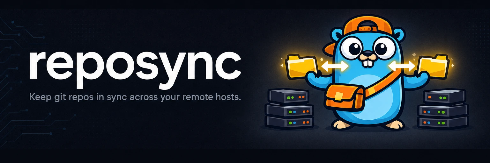

# reposync



[](https://github.com/yasyf/reposync/actions/workflows/ci.yml)
[](https://github.com/yasyf/reposync/blob/main/LICENSE)

Keep git repos in sync across your remote hosts.

reposync is a single Go binary that keeps a set of repositories **converged**
across the machines you work on: present everywhere, and kept on the latest
`main` — without ever clobbering work in progress. Register your hosts, register
your repos, and reposync clones each repo onto every host that is missing it and
fast-forwards it on a timer and on filesystem events.

## Install

```sh
brew install yasyf/tap/reposync
```

## Quickstart

Register a peer host. reposync detects how peers reach this machine (via
Tailscale), installs itself on the peer, registers the inverse host, shares your
repo list, and converges everything:

```sh
reposync host add yasyf@yasyf-home
```

Register a repo. reposync reads its origin, records it relative to your
`default_location` (`~/Code`), propagates it to every peer, and clones it
wherever it is missing:

```sh
reposync repo add ~/Code/cc-review
```

Sync on demand, or let the services do it:

```sh
reposync sync        # idle-safe fetch + fast-forward of every repo
reposync reconcile   # clone any missing repo, then idle-sync the rest
reposync install     # launchd: a 15-minute reconcile tick + a watch daemon
```

## How convergence works

Each repo is tracked by its path relative to `default_location` (`~/Code`), so
the same repo lands at the same place on every host. Registering a host or a repo
clones it wherever it is absent. Clones run `jj git clone --colocate`, so every
checkout has both `.git` and `.jj` whether the origin is jj or plain git; jj is
preferred and plain git is fully supported.

A sync is pull-only. It runs `jj git fetch` (or `git fetch`) plus a safe
fast-forward, and reposync never pushes. It leaves a repo untouched when the
working copy holds in-progress work, the trunk would not fast-forward, or the
repo was active within the idle threshold. A dirty or busy repo is skipped, not
overwritten.

Two triggers drive the timer. A launchd tick reconciles every 15 minutes, so an
offline peer self-heals when it comes back. Between ticks, a watchman-backed watch
daemon notices a trunk change within seconds and notifies peers to pull that one
repo.

A repo with no origin can still be tracked on the host you add it from with
`--local-only`; it is never propagated. Use `reposync repo ls` and
`reposync host ls` to inspect what is registered, and `reposync uninstall` to
remove the launchd agents.

## Prerequisite for cross-host bootstrap

`reposync host add` installs reposync on the peer with `brew install --cask
yasyf/tap/reposync`, which requires a published cask. Cut a goreleaser release so
the cask lands in `yasyf/homebrew-tap` before adding your first host; until then,
`host add` fails fast and tells you to publish a release.

## License

PolyForm-Noncommercial-1.0.0. See [LICENSE](https://github.com/yasyf/reposync/blob/main/LICENSE).
